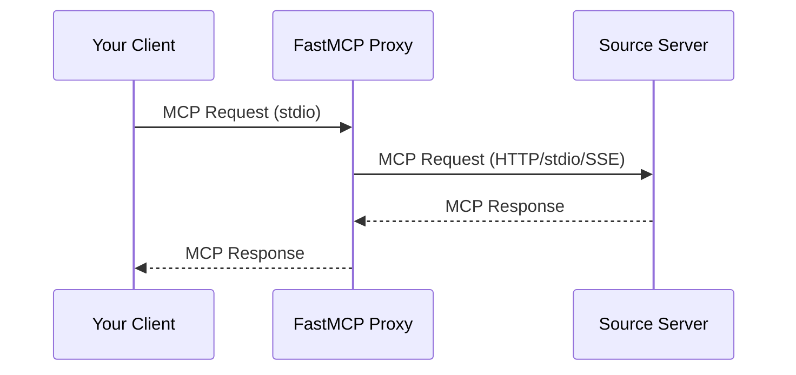

> ## Documentation Index
> Fetch the complete documentation index at: https://gofastmcp.com/llms.txt
> Use this file to discover all available pages before exploring further.

# MCP Proxy Provider

> Source components from other MCP servers

export const VersionBadge = ({version}) => {
  return <Badge stroke size="lg" icon="gift" iconType="regular" className="version-badge">
            New in version <code>{version}</code>
        </Badge>;
};

<VersionBadge version="2.0.0" />

The Proxy Provider sources components from another MCP server through a client connection. This lets you expose any MCP server's tools, resources, and prompts through your own server, whether the source is local or accessed over the network.

## Why Use Proxy Provider

The Proxy Provider enables:

* **Bridge transports**: Make an HTTP server available via stdio, or vice versa
* **Aggregate servers**: Combine multiple source servers into one unified server
* **Add security**: Act as a controlled gateway with authentication and authorization
* **Simplify access**: Provide a stable endpoint even if backend servers change



## Quick Start

<VersionBadge version="2.10.3" />

Create a proxy using `create_proxy()`:

```python theme={"theme":{"light":"snazzy-light","dark":"dark-plus"}}
from fastmcp.server import create_proxy

# create_proxy() accepts URLs, file paths, and transports directly
proxy = create_proxy("http://example.com/mcp", name="MyProxy")

if __name__ == "__main__":
    proxy.run()
```

This gives you:

* Safe concurrent request handling
* Automatic forwarding of MCP features (sampling, elicitation, etc.)
* Session isolation to prevent context mixing

<Tip>
  To mount a proxy inside another FastMCP server, see [Mounting External Servers](/servers/composition#mounting-external-servers).
</Tip>

## Connection Semantics

FastMCP proxies are lazy bridges. Creating the proxy object and starting the local server do not contact the upstream server. During client negotiation, the proxy makes a best-effort request for optional server metadata using the backend client's existing lifecycle and negotiation mode; an unavailable backend does not prevent the client from connecting to the proxy.

Subsequent MCP requests such as `ping`, `tools/list`, `resources/list`, `prompts/list`, tool calls, resource reads, sampling, elicitation, logging, and progress connect to the backend as needed. Component provider failures follow `provider_error_strategy`: the default `"warn"` logs and skips a failed provider, while `"raise"` reports the failure to the client.

## Transport Bridging

A common use case is bridging transports between servers:

```python theme={"theme":{"light":"snazzy-light","dark":"dark-plus"}}
from fastmcp.server import create_proxy

# Bridge HTTP server to local stdio
http_proxy = create_proxy("http://example.com/mcp/sse", name="HTTP-to-stdio")

# Run locally via stdio for Claude Desktop
if __name__ == "__main__":
    http_proxy.run()  # Defaults to stdio
```

Or expose a local server via HTTP:

```python theme={"theme":{"light":"snazzy-light","dark":"dark-plus"}}
from pathlib import Path
from fastmcp.server import create_proxy

# Bridge local server to HTTP
local_proxy = create_proxy(Path("local_server.py"), name="stdio-to-HTTP")

if __name__ == "__main__":
    local_proxy.run(transport="http", host="0.0.0.0", port=8080)
```

## Session Isolation

<VersionBadge version="2.10.3" />

`create_proxy()` provides session isolation - each request gets its own isolated backend session:

```python theme={"theme":{"light":"snazzy-light","dark":"dark-plus"}}
from pathlib import Path
from fastmcp.server import create_proxy

# Each request creates a fresh backend session (recommended)
proxy = create_proxy(Path("backend_server.py"))

# Multiple clients can use this proxy simultaneously:
# - Client A calls a tool → gets isolated session
# - Client B calls a tool → gets different session
# - No context mixing
```

### Shared Sessions

If you pass an already-connected client, the proxy reuses that session:

```python theme={"theme":{"light":"snazzy-light","dark":"dark-plus"}}
from pathlib import Path
from fastmcp import Client
from fastmcp.server import create_proxy

async with Client(Path("backend_server.py")) as connected_client:
    # This proxy reuses the connected session
    proxy = create_proxy(connected_client)

    # ⚠️ Warning: All requests share the same session
```

<Warning>
  Shared sessions may cause context mixing in concurrent scenarios. Use only in single-threaded situations or with explicit synchronization.
</Warning>

## MCP Feature Forwarding

<VersionBadge version="2.10.3" />

Proxies automatically forward MCP protocol features:

| Feature     | Description                     |
| ----------- | ------------------------------- |
| Roots       | Filesystem root access requests |
| Sampling    | LLM completion requests         |
| Elicitation | User input requests             |
| Logging     | Log messages from backend       |
| Progress    | Progress notifications          |

```python theme={"theme":{"light":"snazzy-light","dark":"dark-plus"}}
from pathlib import Path
from fastmcp.server import create_proxy

# All features forwarded automatically
proxy = create_proxy(Path("advanced_backend.py"))

# When the backend:
# - Requests LLM sampling → forwarded to your client
# - Logs messages → appear in your client
# - Reports progress → shown in your client
```

### Disabling Features

Selectively disable forwarding:

```python theme={"theme":{"light":"snazzy-light","dark":"dark-plus"}}
from pathlib import Path

from fastmcp.server.providers.proxy import ProxyClient

backend = ProxyClient(
    Path("backend_server.py"),
    sampling_handler=None,  # Disable LLM sampling
    log_handler=None        # Disable log forwarding
)
```

### Tool Results Are Relayed, Not Inspected

<VersionBadge version="4.0.0" />

A proxy passes a backend's tool results through untouched, including results that don't match the output schema the backend advertised. Deciding whether a server honored its own contract belongs to the client consuming the result, and that client validates for itself.

This matters when a backend's declared schema is subtly wrong — an enum missing a variant it actually returns, say. A proxy that enforced the schema would replace the backend's working response with an error of its own, and the client would never see what the backend actually said.

```python theme={"theme":{"light":"snazzy-light","dark":"dark-plus"}}
from pathlib import Path
from fastmcp import Client
from fastmcp.server import create_proxy

proxy = create_proxy(Path("backend_server.py"))

async with Client(proxy) as client:
    # The backend's response arrives as the backend sent it. If it violates
    # the backend's own output schema, this client raises — its decision.
    result = await client.call_tool("get_status")
```

Skipping the check also avoids a `tools/list` round trip to the backend on every proxied call, since validation would need the backend's schemas and a proxy builds a fresh connection per request.

### Protocol Era Mirroring

<VersionBadge version="4.0.0" />

A proxy is a server on its front and a client on its back, and the two MCP protocol eras have mutually exclusive interaction models on a single session. On the handshake era (≤2025-11-25) the backend can push server-initiated requests — sampling, elicitation, roots — which the proxy forwards to your client. On the modern era (2026-07-28) those pushes are gone; a backend guard tool instead returns an input request that the proxy relays back as a result. A single proxy session speaks one era, so the whole chain has to agree end-to-end.

By default the proxy relays the era: whatever era your client negotiates on the front, the proxy negotiates the same era on its backend connection, per request. A handshake client reaches a handshake backend, so server-initiated forwarding works; a modern client reaches a modern backend, so a guard tool's input request round-trips. Different clients hitting the same proxy each get a backend session in their own era — the eras never cross.

```python theme={"theme":{"light":"snazzy-light","dark":"dark-plus"}}
from pathlib import Path
from fastmcp import Client
from fastmcp.server import create_proxy

# No mode: the backend mirrors each client's negotiated era.
proxy = create_proxy(Path("backend_server.py"))

# A handshake client gets a handshake backend (push-forwarding works).
async with Client(proxy, mode="legacy") as client:
    ...

# A modern client gets a modern backend (guard tools round-trip).
async with Client(proxy, mode="auto") as client:
    ...
```

Passing an explicit `mode` pins the backend to one era regardless of the client:

```python theme={"theme":{"light":"snazzy-light","dark":"dark-plus"}}
from pathlib import Path
# Always negotiate the modern era upstream, whatever the client speaks.
proxy = create_proxy(Path("backend_server.py"), mode="auto")
```

Pinning breaks the end-to-end era agreement, so reserve it for a backend that only speaks one era. When the client's era and the pinned backend era disagree on a feature — a modern client asking for a guard round-trip against a handshake-pinned backend, say — the mismatch surfaces through the normal era gates rather than silently degrading. Mirroring applies to proxies created from a target the proxy connects itself (a URL, path, config, or `FastMCP` instance); when you hand `create_proxy` an already-configured `Client`, that client carries its own mode and mirroring does not override it.

A multi-server configuration adds a hop: FastMCP mounts one proxy per configured server onto a router, and your client talks to that router rather than to any backend directly. The era carries through the whole depth, so each real backend negotiates the era your client did — not just the router in front of them.

```python theme={"theme":{"light":"snazzy-light","dark":"dark-plus"}}
proxy = create_proxy(
    {
        "mcpServers": {
            "weather": {"url": "https://weather.example.com/mcp"},
            "calendar": {"url": "https://calendar.example.com/mcp"},
        }
    }
)
```

A modern client here reaches both `weather` and `calendar` on modern sessions, so a guard tool on either one round-trips end to end. An explicit `mode` pins every backend in the configuration, the same way it pins a single one.

### Request Metadata

Request `_meta` follows the same connection boundary. Progress tokens, tracing, task state, and application or vendor metadata pass through the proxy to the backend. The connection-owned keys — protocol version, client identity, and client capabilities — never copy from the frontend connection: a modern backend session stamps its own negotiated values, and a handshake-era backend receives none. This holds even when the two connections negotiate different eras, such as a modern client reaching a handshake-only backend through an explicit `mode`.

## Configuration-Based Proxies

<VersionBadge version="2.4.0" />

Create proxies from configuration dictionaries:

```python theme={"theme":{"light":"snazzy-light","dark":"dark-plus"}}
from fastmcp.server import create_proxy

config = {
    "mcpServers": {
        "default": {
            "url": "https://example.com/mcp",
            "transport": "http"
        }
    }
}

proxy = create_proxy(config, name="Config-Based Proxy")
```

### Multi-Server Proxies

Combine multiple servers with automatic namespacing:

```python theme={"theme":{"light":"snazzy-light","dark":"dark-plus"}}
from fastmcp.server import create_proxy

config = {
    "mcpServers": {
        "weather": {
            "url": "https://weather-api.example.com/mcp",
            "transport": "http"
        },
        "calendar": {
            "url": "https://calendar-api.example.com/mcp",
            "transport": "http"
        }
    }
}

# Creates unified proxy with prefixed components:
# - weather_get_forecast
# - calendar_add_event
composite = create_proxy(config, name="Composite")
```

## Component Prefixing

Proxied components follow standard prefixing rules:

| Component Type | Pattern                    |
| -------------- | -------------------------- |
| Tools          | `{prefix}_{tool_name}`     |
| Prompts        | `{prefix}_{prompt_name}`   |
| Resources      | `protocol://{prefix}/path` |
| Templates      | `protocol://{prefix}/...`  |

## Mirrored Components

<VersionBadge version="2.10.5" />

Components from a proxy server are "mirrored" - they reflect the remote server's state and cannot be modified directly.

To modify a proxied component (like disabling it), create a local copy:

```python theme={"theme":{"light":"snazzy-light","dark":"dark-plus"}}
from pathlib import Path
from fastmcp import FastMCP
from fastmcp.server import create_proxy

proxy = create_proxy(Path("backend_server.py"))

# Get mirrored tool
mirrored_tool = await proxy.get_tool("useful_tool")

# Create modifiable local copy
local_tool = mirrored_tool.copy()

# Add to your own server
my_server = FastMCP("MyServer")
my_server.add_tool(local_tool)

# Now you can control enabled state
my_server.disable(keys={local_tool.key})
```

## Performance Considerations

Proxying introduces network latency:

| Operation      | Local | Proxied (HTTP) |
| -------------- | ----- | -------------- |
| `list_tools()` | 1-2ms | 300-400ms      |
| `call_tool()`  | 1-2ms | 200-500ms      |

When mounting proxy servers, this latency affects all operations on the parent server.

### Component List Caching

<VersionBadge version="3.2.0" />

`ProxyProvider` caches the backend's component lists (tools, resources, templates, prompts) so that individual lookups — like resolving a tool by name during `call_tool` — don't require a separate backend connection. The cache stores raw component metadata and is shared across all proxy sessions; per-session visibility, auth, and transforms are still applied after cache lookup by the server layer. The cache refreshes whenever an explicit `list_*` call is made, and entries expire after a configurable TTL (default 300 seconds).

For backends whose component lists change dynamically, disable caching by setting `cache_ttl=0`.

```python theme={"theme":{"light":"snazzy-light","dark":"dark-plus"}}
from fastmcp.server.providers.proxy import ProxyProvider, ProxyClient

# Default 300s TTL
provider = ProxyProvider(lambda: ProxyClient("http://backend/mcp"))

# Custom TTL
provider = ProxyProvider(lambda: ProxyClient("http://backend/mcp"), cache_ttl=60)

# Disable caching
provider = ProxyProvider(lambda: ProxyClient("http://backend/mcp"), cache_ttl=0)
```

### Session Reuse for Stateless Backends

By default, each tool call opens a fresh MCP session to the backend. This is the safe default because it prevents state from leaking between requests. However, for stateless HTTP backends where there's no session state to protect, this overhead is unnecessary.

You can reuse a single backend session by providing a client factory that returns the same client instance:

```python theme={"theme":{"light":"snazzy-light","dark":"dark-plus"}}
from fastmcp.server.providers.proxy import FastMCPProxy, ProxyClient

base_client = ProxyClient("http://backend:8000/mcp")
shared_client = base_client.new()

proxy = FastMCPProxy(
    client_factory=lambda: shared_client,
    name="ReusedSessionProxy",
)
```

This eliminates the MCP initialization handshake on every call, which can dramatically reduce latency under load. The `Client` uses reference counting for its session lifecycle, so concurrent callers sharing the same instance is safe.

<Warning>
  Only reuse sessions when you know the backend is stateless (e.g. stateless HTTP). For stateful backends (stdio processes, servers that track session state), use the default fresh-session behavior to avoid context mixing.
</Warning>

## Advanced Usage

### Forwarding Server Metadata

Add `ProxyMetadataMiddleware` when a gateway built with `ProxyProvider` should also expose backend instructions and namespaced `_meta`:

```python theme={"theme":{"light":"snazzy-light","dark":"dark-plus"}}
from fastmcp import FastMCP
from fastmcp.server.providers.proxy import (
    ProxyClient,
    ProxyMetadataMiddleware,
    ProxyProvider,
)

backend = ProxyProvider(lambda: ProxyClient("http://backend:8000/mcp", mode="auto"))
gateway = FastMCP(
    "Controlled Gateway",
    providers=[backend],
    middleware=[ProxyMetadataMiddleware(backend)],
)
```

By default the gateway keeps its own `serverInfo`; pass `identity="upstream"` to use the backend identity when available. Frontend instructions and `_meta` values win on collisions. The middleware never copies upstream protocol versions, connection metadata, capabilities, cache policy, `resultType`, or unknown top-level fields. If the backend is unavailable, the client can still connect without its optional metadata.

### FastMCPProxy Class

For explicit session control, use `FastMCPProxy` directly:

```python theme={"theme":{"light":"snazzy-light","dark":"dark-plus"}}
from pathlib import Path
from fastmcp.server.providers.proxy import FastMCPProxy, ProxyClient

# Custom session factory
def create_client():
    return ProxyClient(Path("backend_server.py"))

proxy = FastMCPProxy(client_factory=create_client)
```

This gives you full control over session creation and reuse strategies.

### Adding Proxied Components to Existing Server

Mount a proxy to add components from another server:

```python theme={"theme":{"light":"snazzy-light","dark":"dark-plus"}}
from fastmcp import FastMCP
from fastmcp.server import create_proxy

server = FastMCP("My Server")

# Add local tools
@server.tool
def local_tool() -> str:
    return "Local result"

# Mount proxied tools from another server
external = create_proxy("http://external-server/mcp")
server.mount(external)

# Now server has both local and proxied tools
```
