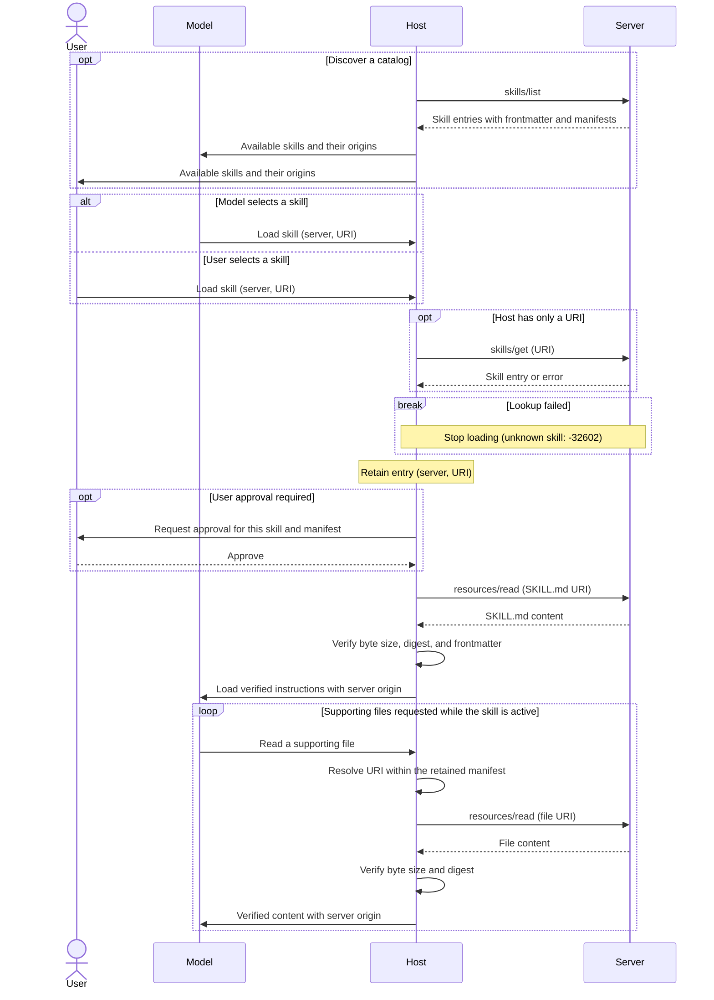

> ## Documentation Index
> Fetch the complete documentation index at: https://modelcontextprotocol.io/llms.txt
> Use this file to discover all available pages before exploring further.

# Skills

> Discover and read Agent Skills from MCP servers

The [ext-skills repository](https://github.com/modelcontextprotocol/ext-skills)
contains the specification for Skills over MCP.

<Card title="modelcontextprotocol/ext-skills" icon="github" href="https://github.com/modelcontextprotocol/ext-skills">
  Specification and documentation for Skills over MCP.
</Card>

The Skills extension allows MCP servers to expose workflow instructions and
supporting files to clients. Clients can discover available skills, retrieve
their metadata, and read their contents using the existing Resources primitive.

A skill is a directory containing a `SKILL.md` file and optional supporting
files, following the [Agent Skills specification](https://agentskills.io/specification).
This extension defines discovery and retrieval over MCP.

Skills are useful for reusable workflows that combine several tools or require
supporting references, such as code review or document processing. Serving them
over MCP keeps those instructions with the service they describe. Clients can
discover available workflows from metadata and load instructions and supporting
files only when needed.

## User Interaction Model

Host applications determine how skills are exposed to the model and user. Skills
can be selected by the model based on their names and descriptions, or explicitly
by the user. The extension does not mandate a specific user interaction model.

Reading `SKILL.md` through `resources/read` does not itself activate a skill.
To load the skill, the host routes the read through its skill-loading path, which
verifies the content and applies any required user approval before loading it
into model context.

## Capabilities

Servers that support Skills **MUST** declare both the `resources` capability and
the `io.modelcontextprotocol/skills` extension in
[`server/discover`](/specification/draft/server/discover):

```json theme={null}
{
  "capabilities": {
    "resources": {},
    "extensions": {
      "io.modelcontextprotocol/skills": {
        "directoryRead": true
      }
    }
  }
}
```

Servers that declare this extension **MUST** implement `skills/list` and
`skills/get`. Skill files are served through `resources/read`.

The optional `directoryRead` setting indicates support for
`resources/directory/read` and defaults to `false`. An empty extension object
indicates support without directory reading. Clients issue `skills/list` and
`skills/get` only after observing the server's declaration.

<Note>
  These examples use protocol revision `2026-07-28` or later. For brevity, the
  request examples omit `_meta`. Every request **MUST** include the required
  [request metadata](/specification/draft/basic/index#_meta).
</Note>

## Protocol Messages

### Listing Skills

To discover available skills, clients send a `skills/list` request. This
operation supports [pagination](/specification/draft/server/utilities/pagination)
and [caching](/specification/draft/server/utilities/caching).

**Request:**

```json theme={null}
{
  "jsonrpc": "2.0",
  "id": 1,
  "method": "skills/list",
  "params": {}
}
```

**Response:**

```json theme={null}
{
  "jsonrpc": "2.0",
  "id": 1,
  "result": {
    "resultType": "complete",
    "skills": [
      {
        "uri": "skill://code-review/SKILL.md",
        "frontmatter": {
          "name": "code-review",
          "description": "Review code using the team's checklist."
        },
        "resources": [
          {
            "uri": "skill://code-review/SKILL.md",
            "digest": "sha256:d2489d6c182e8df9c178563ff9f2eac7998a0c1bb1278c52a7fd5306e4259160",
            "size": 149
          },
          {
            "uri": "skill://code-review/references/checklist.md",
            "digest": "sha256:dbab2de7bf7db9cc95cb6ce681c3690b26184db39f75b958a0287ca6d9e24e20",
            "size": 65
          }
        ]
      }
    ],
    "ttlMs": 300000,
    "cacheScope": "public"
  }
}
```

Each entry contains:

| Field         | Meaning                                                                     |
| ------------- | --------------------------------------------------------------------------- |
| `uri`         | The resource URI of the skill's `SKILL.md`.                                 |
| `frontmatter` | All YAML frontmatter fields, unchanged, including `name` and `description`. |
| `resources`   | The complete file manifest, or `"dynamic"` for generated content.           |

A manifest **MUST** include `SKILL.md` and every supporting file, with each file's
URI, SHA-256 digest, and byte size. Each entry returned by `skills/list` is
complete; clients do not need to call `skills/get` for additional metadata.

When a response includes `nextCursor`, clients pass it as `params.cursor` to
retrieve the next page. List and get results **MUST** include
`resultType: "complete"`, `ttlMs`, and `cacheScope`. The cache fields describe
freshness and sharing; they do not provide content integrity.

Skill identity consists of the originating server's identity and the skill URI.
Names are labels and are not guaranteed to be unique. Hosts **MUST** preserve
both server identity and URI in registries, approvals, and caches. Servers
**SHOULD** use the `skill://` scheme, but **MAY** use another scheme.
Hosts **MUST NOT** identify a resource as a skill solely by its URI scheme.

### Getting a Skill

To retrieve a skill entry by URI, clients send a `skills/get` request. The URI
may be supplied by a user, another skill, or server instructions.

**Request:**

```json theme={null}
{
  "jsonrpc": "2.0",
  "id": 2,
  "method": "skills/get",
  "params": {
    "uri": "skill://code-review/SKILL.md"
  }
}
```

The response contains a skill entry under `result.skill`, with the same shape
as an entry in `skills/list`, alongside `resultType: "complete"`, `ttlMs`,
and `cacheScope`. Clients can also use this method to refresh an existing entry.

Servers **MAY** return empty or partial listings, but **MUST** respond to
`skills/get` for every skill they serve. Hosts **MUST** support loading by URI,
including skills that do not appear in a listing.

### Reading Skill Content

To retrieve skill instructions or supporting files, clients send a
[`resources/read`](/specification/draft/server/resources#reading-resources)
request. This example retrieves the `SKILL.md` from the listing above.

**Request:**

```json theme={null}
{
  "jsonrpc": "2.0",
  "id": 3,
  "method": "resources/read",
  "params": {
    "uri": "skill://code-review/SKILL.md"
  }
}
```

**Response:**

```json theme={null}
{
  "jsonrpc": "2.0",
  "id": 3,
  "result": {
    "resultType": "complete",
    "contents": [
      {
        "uri": "skill://code-review/SKILL.md",
        "mimeType": "text/markdown",
        "text": "---\nname: code-review\ndescription: Review code using the team's checklist.\n---\n\n# Code review\n\nRead `references/checklist.md`, then review the diff.\n"
      }
    ],
    "ttlMs": 300000,
    "cacheScope": "public"
  }
}
```

A `SKILL.md` file **MUST** begin with YAML frontmatter containing `name` and
`description`. The final segment of its parent directory's path **MUST** match
`name`.

Clients resolve relative references against the skill's root directory. In this
example, `references/checklist.md` resolves to
`skill://code-review/references/checklist.md`. The supporting file is retrieved
from the same server using `resources/read` and contains:

```markdown theme={null}
# Review checklist

Check correctness, tests, and compatibility.
```

Both example files end with a newline; their digests and sizes match the manifest.
Hosts **MUST NOT** retrieve files ahead of need, including on connection, listing,
or approval. Approval binds to the manifest without requiring file retrieval.

### Reading Directories

To list a directory's direct children, clients send a `resources/directory/read`
request. This method is optional. Clients **MUST NOT** call it unless the server
declares `directoryRead: true`.

**Request:**

```json theme={null}
{
  "jsonrpc": "2.0",
  "id": 4,
  "method": "resources/directory/read",
  "params": {
    "uri": "skill://code-review/references"
  }
}
```

**Response:**

```json theme={null}
{
  "jsonrpc": "2.0",
  "id": 4,
  "result": {
    "resultType": "complete",
    "resources": [
      {
        "uri": "skill://code-review/references/checklist.md",
        "name": "checklist.md",
        "mimeType": "text/markdown"
      }
    ]
  }
}
```

Directory URIs have no trailing slash. Child directories use
`mimeType: "inode/directory"`. Clients descend by issuing another request for
a child directory. Results support `cursor` / `nextCursor` pagination and
contain direct children only.

For skills with a manifest, hosts **MAY** answer directory queries from that
manifest. Directory reading also supports dynamic skills and other resource
trees. Hosts **MUST NOT** treat a live directory result as extending the retained
manifest or expose newly listed files as part of the skill. Access to those files
requires an entry refresh and any required user approval.

## Message Flow

This example shows loading a skill with a file manifest, after
server capabilities have been discovered. The host's MCP client sends the
protocol requests. Skill selection and user approval are host interactions.



A known URI can be loaded without listing. An entry returned by `skills/list`
can be reused; otherwise, the host calls `skills/get`. An unlisted skill may
still exist, but an unknown URI returns `-32602` (Invalid params) and stops
loading. All skill reads use the originating server.

If lookup fails, approval is denied, or verification fails, the host does not load
or use the content. Recovering from a changed manifest requires refreshing the
entry and obtaining any required approval again, as described below.

## Integrity and Verification

While acting on a skill, the host retains the entry used to load it. This period
extends at least until the skill's `SKILL.md` leaves model context. For skills
with a manifest, hosts **MUST**:

1. Restrict file reads to URIs in the retained manifest.
2. Verify each file's raw byte size and SHA-256 digest before use.
3. Parse `SKILL.md` frontmatter and compare it field-by-field with the entry's
   `frontmatter`.

Hosts **MUST NOT** use content that fails verification. To recover from stale
metadata, the host refreshes the entry with `skills/get`. Persisted approval
**MUST** bind to the complete set of file URIs and digests. A changed, added, or
removed file revokes that approval; the host **MUST** obtain approval again
before loading or executing.

Hosts **SHOULD** cache verified content on demand. Disk caches **MUST** either
prevent modification by the model, its tools, or other users and keep files
immutable, or verify cached bytes on every access. Hosts **MUST** exclude cached
files from filesystem-skill discovery paths and preserve their MCP origin,
including after a restart.

<Note>
  Digests establish consistency with the server's manifest, not trust in its
  content. For generated content without stable digests, an entry uses
  `"resources": "dynamic"`. Hosts **MAY** decline these skills. If accepted,
  hosts **MUST** still verify frontmatter and **MUST NOT** treat persisted
  approval as covering arbitrary future content.
</Note>

## Implementation Requirements

### Servers

Servers **MUST**:

* Serve valid Agent Skills and implement the declared methods, including base
  Resources support.
* Preserve all frontmatter fields and publish complete manifests computed from
  the bytes served, unless the skill's resources are declared `"dynamic"`.
* Support direct lookup independently of listing. Each skill entry is atomic;
  its manifest **MUST NOT** be split across pages.
* Support every directory in the served skill namespaces when declaring
  `directoryRead: true`.

Servers **SHOULD NOT** exceed **512 files or 16 MiB per skill**, including
`SKILL.md`. Hosts **MUST** support skills up to these limits and **MAY** support
larger skills.

### Security Considerations

Hosts **MUST**:

* Prevent skills with the same name from silently replacing one another.
* Tag loaded content with its originating server and bind resource reads to that
  server using a host-assigned label. Cross-server reads require explicit
  per-call approval naming both servers.
* Treat skill content as untrusted input. Host-side code execution and permission
  grants such as `allowed-tools` require explicit per-skill user approval.
* Obtain fresh user consent before activating a nested skill. Reading its
  `SKILL.md` as supporting content does not activate it or its frontmatter.

See the [security requirements](https://github.com/modelcontextprotocol/ext-skills/blob/main/specification/stable/skills.mdx#security-considerations)
for the full approval, origin, and cache rules.

## Error Handling

| Condition                                       | Handling                                      |
| ----------------------------------------------- | --------------------------------------------- |
| Unknown skill/file, or invalid directory URI    | JSON-RPC `-32602` (Invalid params).           |
| Internal server failure                         | JSON-RPC `-32603` (Internal error).           |
| Digest, size, frontmatter, or manifest mismatch | Host rejects content and refreshes the entry. |

Verification failures are host-side conditions rather than protocol errors.
They are handled as described in [Integrity and Verification](#integrity-and-verification).

## Client Support

See the [client matrix](/extensions/client-matrix) for Skills support and links
to implementation documentation.

## Specification

The full specification is in the [ext-skills repository](https://github.com/modelcontextprotocol/ext-skills/blob/main/specification/stable/skills.mdx).
Development is coordinated by the [Skills Over MCP Working Group](/community/working-groups/skills-over-mcp).
